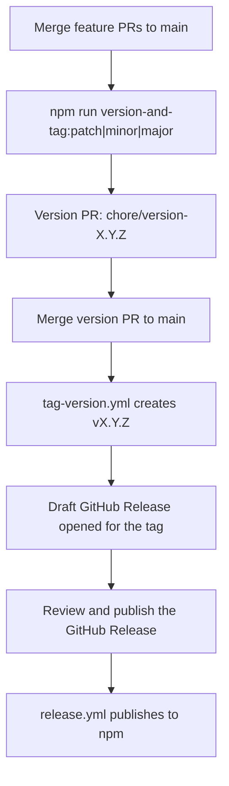

# npm publication

Jigsaw packages are published to the [npm registry](https://www.npmjs.com/) under the **`@jigsaw-ds`** organization.

## Publish set

Publishable packages are discovered automatically (`turbo ls`, minus `private` and `.changeset` `ignore`):

| Package | Description |
|---------|-------------|
| `@jigsaw-ds/design-system` | React components |
| `@jigsaw-ds/tokens` | Shared tokens + Tailwind v4 theme CSS |
| `@jigsaw-ds/theme-default` | Default light/dark theme |
| `@jigsaw-ds/theme-portfolio` | Portfolio theme |
| `@jigsaw-ds/theme-build` | Style Dictionary build helpers (shared by themes/tokens) |

Private / not published: `@jigsaw-ds/storybook`, root `jigsaw`, `web`.

All five publishable `@jigsaw-ds/*` packages are a Changesets **fixed** group — they always share the same version so consumers know which theme, tokens, and design-system releases work together.

## Versioning

Public packages start at **`0.1.0`**. The API is not yet stable; `0.x` signals that under semver. `1.0.0` is reserved for a later, deliberate stability commitment.

Optional prereleases before promoting `latest`:

```bash
npx changeset pre enter alpha   # or beta → 0.1.0-alpha.0, .1, …
npx changeset pre exit
```

## License

The repository is MIT licensed (`LICENSE` at the repo root). Each publishable package includes an **identical copy** of that file. CI (`npm run verify:packages`) asserts every package `LICENSE` matches the root text byte-for-byte.

## Release flow

Feature PRs stay focused on code — **no** `.changeset/*.md` files. Versioning is a deliberate maintainer command; npm publish is a separate GitHub Release click.



### 1. Land package changes on `main`

Open normal feature PRs. **Do not** commit anything under `.changeset/` except `config.json` / `README.md` (CI enforces this).

### 2. Version (open a PR)

On a clean `main` checkout:

```bash
git checkout main && git pull
npm run version-and-tag:patch   # or :minor / :major
```

`version-and-tag` ([scripts/version-and-tag.mjs](../scripts/version-and-tag.mjs)):

1. Detects which publishable packages changed since the last `v*` tag (`turbo` + Changesets `fixed` groups)
2. Writes a temporary Changeset with your chosen bump
3. Runs `changeset version` (updates `package.json` + `CHANGELOG.md`)
4. Creates branch `chore/version-{version}`, commits `chore: version packages`, pushes, and opens a PR to `main`
5. Leaves local `main` at the pre-version tip

Merge that PR (squash is fine). [tag-version.yml](../.github/workflows/tag-version.yml) then creates annotated tag `v{version}` when the merged commit subject matches `chore: version packages…`.

Preview without writing:

```bash
npm run version-and-tag:minor -- --dry-run
```

Leave the version branch local (skip push / PR):

```bash
npm run version-and-tag:patch -- --no-push
```

### 3. Publish the GitHub Release (npm)

[tag-version.yml](../.github/workflows/tag-version.yml) creates the `v*` tag and a **draft** [GitHub Release](https://github.com/decodedcreative/jigsaw/releases) in the same job (GITHUB_TOKEN tag pushes do not trigger other workflows); [draft-github-release.yml](../.github/workflows/draft-github-release.yml) remains a fallback for human-pushed tags.

Publishing that release triggers [release.yml](../.github/workflows/release.yml), which:

1. Checks out the tag
2. Confirms the tag matches `@jigsaw-ds/design-system`
3. Confirms changelog sections exist
4. Runs `npm run publish` (`validate:packages` then `changeset publish`)

Requires repository secret `NPM_TOKEN`.

### Local checks

```bash
# Which packages would be included in the next version?
npm run generate-changeset -- --dry-run

npm run validate:packages
npx changeset publish --dry-run
```

`generate-changeset` is normally invoked by `version-and-tag`. Pass `--force` only if a pending `auto-*.md` already exists and you need to regenerate it (e.g. changing bump). Pass `--since <ref>` if there is no `v*` tag yet (bootstrap).

## npm organization

| Candidate | Result |
|-----------|--------|
| `@jigsaw` | Org already exists (~46 packages, unrelated) |
| `@jsw` | Not available |
| `@jigsaw-ds` | **Claimed** — use this scope |

## See also

- [using-jigsaw.md](./using-jigsaw.md) — consumer install guide
