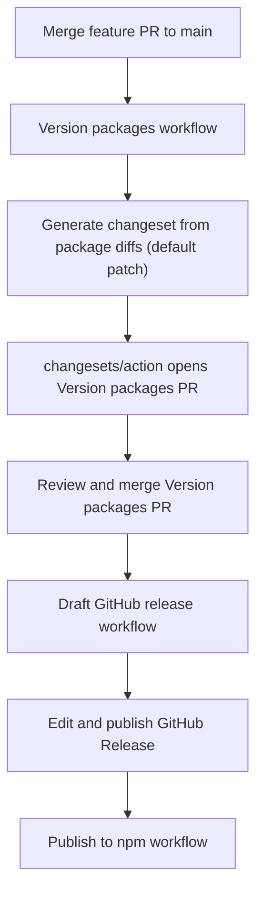

# npm publication

Jigsaw packages are published to the [npm registry](https://www.npmjs.com/) under the **`@jigsaw-ds`** organization.

## Publish set

| Package | Description |
|---------|-------------|
| `@jigsaw-ds/design-system` | React components |
| `@jigsaw-ds/tokens` | Shared tokens + Tailwind v4 theme CSS |
| `@jigsaw-ds/theme-default` | Default light/dark theme |
| `@jigsaw-ds/theme-portfolio` | Portfolio theme |
| `@jigsaw-ds/theme-build` | Style Dictionary build helpers (shared by themes/tokens) |

Private / not published:

- `@jigsaw-ds/storybook` — internal Storybook app
- Root `jigsaw` workspace — monorepo orchestration only

`@jigsaw-ds/design-system` and `@jigsaw-ds/tokens` are a Changesets **fixed** group — they always share the same version.

## Versioning

Public packages start at **`0.1.0`**. The API is not yet stable; `0.x` signals that under semver. `1.0.0` is reserved for a later, deliberate stability commitment.

Semver bumps are **chosen explicitly** (default `patch`). File diffs decide *which* packages change; maintainers decide *how far* to bump via npm scripts or a workflow input — no conventional-commit linter required.

Optional prereleases before promoting `latest`:

```bash
npx changeset pre enter alpha   # or beta → 0.1.0-alpha.0, .1, …
npx changeset pre exit          # return to normal releases
```

## License

The repository is MIT licensed (`LICENSE` at the repo root). Each publishable package includes an **identical copy** of that file so npm tarballs satisfy registry licensing requirements. CI (`npm run verify:packages`) asserts every package `LICENSE` matches the root text byte-for-byte.

## Release flow (current)

Feature PRs **do not** include `.changeset/*.md` files. Release metadata is generated on `main` by CI.



### 1. Land consumer-facing package changes on `main`

Open a normal feature PR. Touch files under the publish set as needed. **Do not** run `npm run changeset` and **do not** commit anything under `.changeset/` except `config.json` / `README.md`.

CI fails feature PRs that add other files under `.changeset/` (see [ci.yml](../.github/workflows/ci.yml)).

### 2. Auto-changeset + Version packages PR

On every push to `main`, [version-packages.yml](../.github/workflows/version-packages.yml):

1. Runs `npm run generate-changeset -- --bump patch` ([scripts/generate-changeset-from-changes.mjs](../scripts/generate-changeset-from-changes.mjs))
2. Discovers publishable packages via `turbo ls` (skipping `private` and `.changeset` `ignore`) and detects which changed since the newer of the latest `v*` tag / `chore: version packages` commit (`turbo run build --filter=[since] --dry-run=json`)
3. Applies Changesets `fixed` groups (design-system + tokens)
4. Writes a single `.changeset/auto-*.md` when packages changed and no pending changesets already exist
5. Runs [changesets/action](https://github.com/changesets/action), which opens (or updates) a **Version packages** PR that bumps `package.json` versions, internal dependency ranges, and `CHANGELOG.md` files

That baseline choice means merging the Version packages PR does not immediately open another one before a release tag exists.

Review that PR like any other, then merge it.

### Choosing minor or major

Push-to-`main` always prepares a **patch** unless you ask for more:

```bash
# On main (or any checkout that includes the package diffs) — regenerates the pending changeset
npm run release:patch   # same as the default CI bump
npm run release:minor
npm run release:major
```

Or run **Version packages → Run workflow** in GitHub Actions and pick `patch` / `minor` / `major`. That path passes `--force` so an existing auto-changeset is replaced with the chosen bump.

`--force` means: delete pending `.changeset/*.md` (except README) and write a fresh auto-changeset. Use it when changing bump type; everyday push-to-main CI does **not** pass `--force`, so it will not clobber a changeset you already prepared with `release:minor`.

### 3. Draft GitHub Release

After version bumps land on `main`, [draft-github-release.yml](../.github/workflows/draft-github-release.yml) creates or updates a **draft** [GitHub Release](https://github.com/decodedcreative/jigsaw/releases) for `v{version}` with notes aggregated from package changelogs ([scripts/github-release-notes.mjs](../scripts/github-release-notes.mjs)).

### 4. Publish the GitHub Release → npm

Publishing the GitHub Release is the deliberate gate. That event triggers [publish-npm.yml](../.github/workflows/publish-npm.yml), which:

1. Checks out the release tag
2. Confirms the tag matches `@jigsaw-ds/design-system`’s version
3. Confirms changelog sections exist for that version
4. Runs `npm run release` (`validate:packages` then `changeset publish`)

Requires repository secret `NPM_TOKEN` (npm automation token with publish access to `@jigsaw-ds/*`).

### Local checks

```bash
# Preview which packages would be included (default patch)
npm run generate-changeset -- --since v0.1.0 --dry-run

# Preview a minor bump without writing files
npm run generate-changeset -- --since v0.1.0 --bump minor --dry-run --force

# Before merging a Version packages PR / cutting a release
npm run validate:packages
npx changeset publish --dry-run
```

## npm organization

| Candidate | Result |
|-----------|--------|
| `@jigsaw` | Org already exists (~46 packages, unrelated) |
| `@jsw` | Not available |
| `@jigsaw-ds` | **Claimed** — use this scope |

## Related tickets

Epic [JSW-99](https://decodedcreative.atlassian.net/browse/JSW-99) covered the initial publish pipeline. Auto-changeset generation: [JSW-112](https://decodedcreative.atlassian.net/browse/JSW-112). Consumer install guide: [using-jigsaw.md](./using-jigsaw.md).
