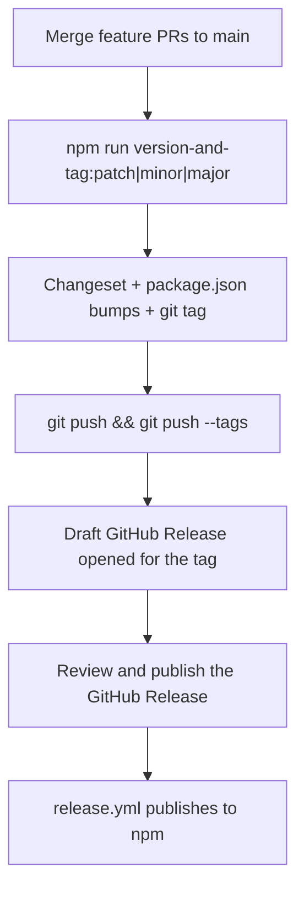

# npm publication

Jigsaw packages are published to the [npm registry](https://www.npmjs.com/) under the **`@jigsaw-ds`** organization.

## Publish set

Publishable packages are discovered automatically (`turbo ls`, minus `private` and `.changeset` `ignore`):

| Package | Description |
|---------|-------------|
| `@jigsaw-ds/design-system` | React components |
| `@jigsaw-ds/tokens` | Shared tokens + Tailwind v4 theme CSS |
| `@jigsaw-ds/theme-default` | Default light/dark theme |
| `@jigsaw-ds/theme-portfolio` | Portfolio theme |
| `@jigsaw-ds/theme-build` | Style Dictionary build helpers (shared by themes/tokens) |

Private / not published: `@jigsaw-ds/storybook`, root `jigsaw`, `web`.

`@jigsaw-ds/design-system` and `@jigsaw-ds/tokens` are a Changesets **fixed** group — they always share the same version.

## Versioning

Public packages start at **`0.1.0`**. The API is not yet stable; `0.x` signals that under semver. `1.0.0` is reserved for a later, deliberate stability commitment.

Optional prereleases before promoting `latest`:

```bash
npx changeset pre enter alpha   # or beta → 0.1.0-alpha.0, .1, …
npx changeset pre exit
```

## License

The repository is MIT licensed (`LICENSE` at the repo root). Each publishable package includes an **identical copy** of that file. CI (`npm run verify:packages`) asserts every package `LICENSE` matches the root text byte-for-byte.

## Release flow

Feature PRs stay focused on code — **no** `.changeset/*.md` files. Versioning is a deliberate maintainer command; npm publish is a separate GitHub Release click.



### 1. Land package changes on `main`

Open normal feature PRs. **Do not** commit anything under `.changeset/` except `config.json` / `README.md` (CI enforces this).

### 2. Version and tag

On a clean `main` checkout:

```bash
git checkout main && git pull
npm run version-and-tag:patch   # or :minor / :major
git push && git push origin vX.Y.Z
```

`version-and-tag` ([scripts/version-and-tag.mjs](../scripts/version-and-tag.mjs)):

1. Detects which publishable packages changed since the last `v*` tag (`turbo` + Changesets `fixed` groups)
2. Writes a temporary Changeset with your chosen bump
3. Runs `changeset version` (updates `package.json` + `CHANGELOG.md`)
4. Commits `chore: version packages` and creates annotated tag `v{version}`

Preview without writing:

```bash
npm run version-and-tag:minor -- --dry-run
```

Push commit + tag in one step with `--push`:

```bash
npm run version-and-tag:patch -- --push
```

### 3. Publish the GitHub Release (npm)

Pushing the `v*` tag opens a **draft** [GitHub Release](https://github.com/decodedcreative/jigsaw/releases) with notes from package changelogs.

Publishing that release triggers [release.yml](../.github/workflows/release.yml), which:

1. Checks out the tag
2. Confirms the tag matches `@jigsaw-ds/design-system`
3. Confirms changelog sections exist
4. Runs `npm run publish` (`validate:packages` then `changeset publish`)

Requires repository secret `NPM_TOKEN`.

### Local checks

```bash
# Which packages would be included in the next version?
npm run generate-changeset -- --dry-run --force

npm run validate:packages
npx changeset publish --dry-run
```

## npm organization

| Candidate | Result |
|-----------|--------|
| `@jigsaw` | Org already exists (~46 packages, unrelated) |
| `@jsw` | Not available |
| `@jigsaw-ds` | **Claimed** — use this scope |

## Related tickets

Epic [JSW-99](https://decodedcreative.atlassian.net/browse/JSW-99). Auto-changeset / release docs: [JSW-112](https://decodedcreative.atlassian.net/browse/JSW-112). Consumer install guide: [using-jigsaw.md](./using-jigsaw.md).
